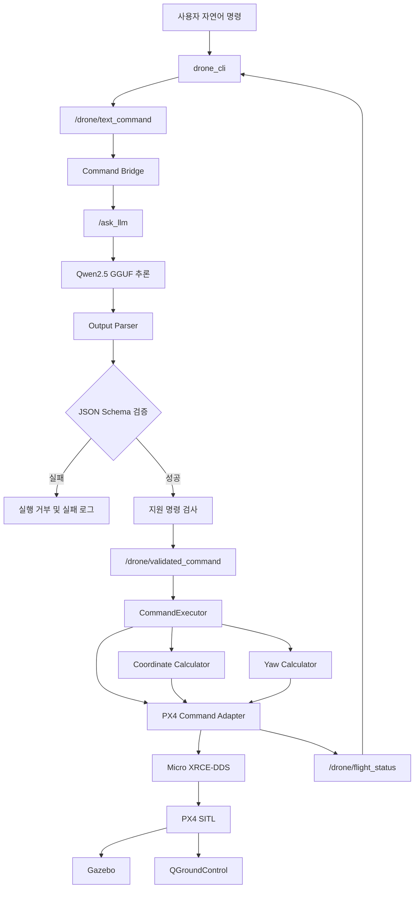

# 🚁 ROS2-Gazebo-Drone-Sim

## 🚁 프로젝트 소개

자연어 드론 명령을 구조화된 함수 호출로 변환하고, ROS 2와 PX4 Offboard 제어를 통해 Gazebo 드론 시뮬레이터에서 실행하는 연구 프로젝트입니다.

사용자는 다음과 같은 자연어 명령으로 드론을 제어할 수 있습니다.

```text
시동 걸어
2미터 이륙해
앞으로 1미터 이동해
오른쪽으로 90도 회전해
10초 동안 호버링해
취소해
착륙해
긴급 정지해
```

Qwen2.5 기반 GGUF 모델이 자연어를 함수 스키마 형식의 JSON 명령으로 변환합니다. 생성된 명령은 출력 파서, JSON Schema, 명령 실행기와 PX4 안전 검사를 통과한 경우에만 비행 제어 계층으로 전달됩니다.

현재 다음 명령의 자연어 입력부터 Gazebo 기체 동작까지 종단 간 시뮬레이션 검증을 완료했습니다.

```text
arm
takeoff
move_drone
rotate_relative
hover
cancel
land
emergency_stop
```

Qwen2.5 명령 해석, JSON Schema 검증, 명령 실행, PX4 좌표 이동, 상대 회전, 비행 상태 알림과 시뮬레이션 테스트 로그를 각각 모듈화하여 개발하고 있습니다.

최종적으로는 Jetson Orin NX에서 명령 해석과 비행 제어 노드를 구동하는 온디바이스 시스템을 목표로 합니다.

> 현재 프로젝트는 PX4 SITL과 Gazebo를 사용하는 시뮬레이션 검증 단계입니다.  
> 실기체에 적용하기 전 별도의 하드웨어 안전장치와 충분한 비행 검증이 필요합니다.

## 👥 프로젝트 정보

| 역할 | 담당자 |
|---|---|
| 조장 | 권동재 |
| VLA 파인튜닝 | 정윤상, 조용만 |
| 함수 스키마 및 드론 제어 | 조현준 |
| 지도강사 | 박승휘 |

## 📌 Git Commit Convention

| Prefix | 설명 |
|---|---|
| `[feature]` | 새로운 기능 또는 알고리즘 추가 |
| `[bugfix]` | 기존 기능의 오류 수정 |
| `[ignore]` | 주석, 문서, 코드 정리 등 동작에 영향을 주지 않는 변경 |

커밋 메시지 예시:

```bash
git commit -m "[feature] PX4 상대 회전 기능 추가"
git commit -m "[bugfix] 목표 고도 판정 오류 수정"
git commit -m "[ignore] README 프로젝트 현황 갱신"
```

## 📚 목차

- [프로젝트 목표](#-프로젝트-목표)
- [현재 구현 상태](#-현재-구현-상태)
- [시스템 구조](#️-시스템-구조)
- [자연어 명령 처리 흐름](#️-자연어-명령-처리-흐름)
- [주요 기능](#-주요-기능)
- [프로젝트 구조](#-프로젝트-구조)
- [환경 요구 사항](#-환경-요구-사항)
- [설치 및 빌드](#️-설치-및-빌드)
- [시뮬레이터 실행](#-시뮬레이터-실행)
- [런타임 PX4 명령](#️-런타임-px4-명령)
- [LLM 서비스](#-llm-서비스)
- [시뮬레이션 테스트 로그](#-시뮬레이션-테스트-로그)
- [학습 및 평가](#-학습-및-평가)
- [안전 설계](#️-안전-설계)
- [테스트](#-테스트)
- [개발 일지](#-개발-일지)
- [참고 저장소](#-참고-저장소)
- [향후 계획](#-향후-계획)
- [주의사항](#️-주의사항)

## 🎯 프로젝트 목표

사용자의 자연어 명령을 다음 흐름으로 처리하는 드론 제어 시스템을 구현합니다.

```text
사용자 자연어 명령
        |
        v
Qwen2.5 기반 LLM 서비스
        |
        v
함수 스키마 형식의 JSON 출력
        |
        v
출력 파서 및 JSON Schema 검증
        |
        v
Command Bridge
        |
        v
/drone/validated_command
        |
        v
CommandExecutor
        |
        v
PX4 Command Adapter
        |
        v
PX4 Offboard 제어 메시지
        |
        v
Micro XRCE-DDS
        |
        v
PX4 SITL + Gazebo 드론
```

LLM이 잘못된 문자열, 범위를 벗어난 숫자 또는 지원하지 않는 명령을 생성하더라도 해당 값이 바로 PX4로 전달되지 않도록 다음 계층을 분리합니다.

1. LLM 출력 생성
2. JSON 파싱
3. JSON Schema 검증
4. 자연어 브리지 지원 명령 검사
5. CommandExecutor 인자 검사
6. PX4 메시지 및 기체 상태 검사
7. PX4 명령과 Offboard Setpoint 발행
8. 실행 상태 및 실패 원인 기록

## ✅ 현재 구현 상태

| 구분 | 상태 | 설명 |
|---|---|---|
| 드론 명령 JSON Schema | 완료 | 명령 이름, 인자와 응답 상태 검증 |
| LLM 출력 파서 | 완료 | 모델 원문 출력의 JSON 파싱 및 검증 |
| LoRA 학습·평가 파이프라인 | 완료 | Qwen2.5-3B-Instruct 기반 학습과 비교 평가 |
| GGUF LLM 서비스 | 완료 | ROS 2 `/ask_llm` 서비스 제공 |
| 자연어 명령 브리지 | 완료 | 검증된 단일 명령을 런타임 토픽으로 발행 |
| Action History | 완료 | 성공적으로 실행된 명령 이력 저장 |
| Reverse Executor | 완료 | 실행 이력을 이용한 역방향 명령 생성 |
| Mission FSM | 완료 | 임무 상태와 상태 전환 조건 관리 |
| Coordinate Calculator | 완료 | 절대좌표 및 기수 기준 상대좌표 계산 |
| Yaw Calculator | 완료 | 상대 회전 목표와 최단 회전 오차 계산 |
| CommandExecutor | 완료 | 검증된 명령을 대응하는 비행 함수로 전달 |
| PX4 시작 안전 검사 | 완료 | 중복 제어 노드, 위치·속도·상태 검사 |
| 런타임 명령 대기 | 완료 | 안전 검사 후 `IDLE` 상태에서 명령 대기 |
| 독립 시동 `arm` | 시뮬레이션 검증 완료 | 일반 Arm 요청과 Armed 상태 확인 |
| 목표 고도 이륙 `takeoff` | 시뮬레이션 검증 완료 | Offboard 전환 후 지정 고도까지 이륙 |
| 상대이동 `move_drone` | 시뮬레이션 검증 완료 | 앞·뒤·왼쪽·오른쪽·위·아래 이동 |
| 상대회전 `rotate_relative` | 시뮬레이션 검증 완료 | 현재 기수 기준 좌우 회전 |
| 호버링 `hover` | 시뮬레이션 검증 완료 | 무기한 또는 지정 시간 동안 위치 유지 |
| 명령 취소 `cancel` | 시뮬레이션 검증 완료 | 진행 중인 동작을 중단하고 현재 위치 유지 |
| 자동 착륙 `land` | 시뮬레이션 검증 완료 | PX4 자동 착륙과 Disarm 확인 |
| 긴급 정지 `emergency_stop` | 시뮬레이션 검증 완료 | Setpoint 중단과 PX4 강제 Disarm |
| 홈 기준 절대좌표 이동 | 기능 검증 완료 | PX4 Local NED 좌표 변환과 이동 |
| 비행 상태 알림 | 완료 | `/drone/flight_status`로 상태 발행 |
| 시뮬레이션 자동 실행 | 완료 | 테스트 월드와 전체 노드 일괄 실행 |
| 시뮬레이션 테스트 로거 | 완료 | 명령, 좌표, 결과와 실패 원인 JSONL 기록 |
| 자연어 종단 간 연동 | 시뮬레이션 검증 완료 | 8개 단일 명령의 실제 Gazebo 동작 확인 |
| `return_home` | 코드 연결 완료 | PX4 Return 모드와 완료 상태 확인 연결 |
| `recall` | 코드 연결 완료 | 성공한 이동·회전 이력을 역순으로 순차 실행 |
| `move_clock_direction` | 예정 | 기존 상대좌표 계산과 이동 로직 재사용 |
| `take_photo` | 예정 | Gazebo 카메라 촬영 이벤트 연결 |
| 속도 지정 제어 | 예정 | 이동 및 회전 속도를 PX4 제어에 반영 |
| 복합 명령 순차 실행 | 예정 | 각 명령 완료 후 다음 명령 실행 |
| Vision/VLM 물체 접근 | 예정 | 카메라 또는 Depth 기반 목표 접근 |
| Jetson Docker 배포 | 예정 | Jetson Orin NX 8GB 대상 구성 |

## 🏗️ 시스템 구조



현재 다음 종단 간 흐름의 구현과 시뮬레이션 검증을 완료했습니다.

```text
자연어 CLI
→ LLM 추론
→ JSON 출력 파싱 및 검증
→ Command Bridge
→ CommandExecutor
→ PX4 Command Adapter
→ PX4 SITL
→ Gazebo 기체 동작
→ 비행 상태 출력
```

## ⌨️ 자연어 명령 처리 흐름

사용자 입력:

```text
2미터 이륙해
```

LLM 응답:

```json
{
  "status": "accepted",
  "commands": [
    {
      "name": "takeoff",
      "arguments": {
        "altitude_m": 2
      }
    }
  ],
  "message": null
}
```

PX4 어댑터에 전달되는 단일 명령:

```json
{
  "name": "takeoff",
  "arguments": {
    "altitude_m": 2
  }
}
```

현재 자연어 브리지와 PX4 런타임이 모두 지원하는 명령은 다음과 같습니다.

```text
arm
takeoff
land
move_drone
rotate_relative
hover
cancel
emergency_stop
```

`disarm`은 명령 스키마와 `CommandExecutor`에 정의되어 있지만 PX4 런타임의 독립 명령으로는 아직 연결되지 않았습니다.

`arm`은 지상에서 모터만 활성화하는 독립 명령입니다. Offboard 전환이나 이륙을 수행하지 않으며, `takeoff`는 필요한 Arm 동작을 자체적으로 수행합니다.

현재 브리지는 검증된 명령이 정확히 하나인 경우에만 PX4 어댑터로 전달합니다. 복합 명령의 순차 실행은 아직 지원하지 않습니다.

## ✨ 주요 기능

### 명령 스키마

현재 스키마에서 정의하는 주요 명령은 다음과 같습니다.

| 명령 | 설명 |
|---|---|
| `arm` | 모터 활성화 |
| `disarm` | 모터 비활성화 |
| `takeoff` | 지정한 고도까지 이륙 |
| `land` | 자동 착륙 |
| `move_drone` | 기수 기준 방향과 거리만큼 이동 |
| `move_clock_direction` | 시계 방향 기준 이동 |
| `rotate_relative` | 현재 기수 기준 상대 회전 |
| `hover` | 현재 위치 유지 |
| `take_photo` | 사진 촬영 요청 |
| `return_home` | 홈 위치로 복귀 |
| `recall` | 실행 이력을 역순으로 따라 복귀 |
| `cancel` | 진행 중인 동작 취소 |
| `emergency_stop` | Setpoint 중단 및 강제 Disarm |

모델 응답 상태는 다음과 같이 구분합니다.

| 상태 | 의미 |
|---|---|
| `accepted` | 실행 가능한 명령 |
| `clarification_required` | 거리·높이·각도 등의 추가 정보 필요 |
| `unsupported` | 현재 지원하지 않는 기능 |
| `invalid` | 드론 명령으로 판단할 수 없는 입력 |

### CommandExecutor

`CommandExecutor`는 검증된 단일 명령을 대응하는 비행 함수로 전달합니다.

주요 검증 항목:

- 명령 객체의 `name`, `arguments` 구조 검사
- 지원하지 않는 명령 거부
- 필수 인자 누락 검사
- 정의되지 않은 추가 인자 거부
- 불리언을 숫자로 사용하는 입력 거부
- `NaN`, `Infinity` 등 비유한 숫자 거부
- 0 이하의 거리·고도·속도·시간 거부
- 지원하지 않는 이동 방향 거부
- 잘못된 명령이 비행 함수에 전달되지 않았는지 검사

### PX4 좌표계

PX4는 NED 좌표계를 사용합니다.

| 축 | 양의 방향 |
|---|---|
| X | 북쪽 |
| Y | 동쪽 |
| Z | 아래쪽 |

상승할 때는 Z 값이 감소하고, 하강할 때는 Z 값이 증가합니다.

### 좌표 이동

- 홈 위치 기준 절대좌표 이동
- 현재 기수 기준 상대이동
- 앞·뒤·왼쪽·오른쪽·위·아래 이동
- 목표 위치 도달 오차 검사
- 현재 위치와 목표 위치 로그 출력
- 목표 위치 도달 후 호버링 전환

### 상대 회전

- 현재 Heading을 기준으로 목표 Yaw 계산
- 오른쪽 회전은 양수 각도
- 왼쪽 회전은 음수 각도
- ±180도 경계에서 최단 회전 오차 계산
- 목표 Yaw 도달 후 위치 및 기수 유지

### 런타임 상태 관리

PX4 명령 어댑터는 실행 직후 자동 이륙하지 않습니다.

```text
PX4 위치 및 상태 메시지 수신
→ 사전 비행 안전 검사
→ 연속 안정성 검사
→ IDLE 상태
→ 검증된 명령 대기
```

준비 완료 시 다음 로그가 출력됩니다.

```text
Vehicle data is stable. Waiting for a validated command.
```

이륙 준비 중 순간적인 속도 노이즈가 발생하면 안정성 카운터를 즉시 완전히 초기화하지 않고 일부만 감소시킵니다. 제한 시간 안에 안정성이 확보되면 이륙을 계속하고, 확보되지 않으면 이륙을 취소합니다.

## 📁 프로젝트 구조

```text
ROS2-Gazebo-Drone-Sim/
├── data/
│   ├── dataset_v0.1/
│   ├── dataset_v0.2/
│   ├── dataset_v0.3/
│   ├── dataset_v0.4/
│   ├── dataset_v0.5/
│   ├── dataset_v0.6/
│   └── dataset_v0.7/
├── docs/
│   └── python_coding_standard.md
├── model/
│   ├── v0.4-Q4_K_M.gguf
│   └── v0.4-q4_k_m_eval.json
├── scripts/
│   └── run_natural_flight_sim.sh
├── src/
│   ├── drone_command_interface/
│   │   └── drone_command_interface/
│   │       ├── prompts/
│   │       ├── schemas/
│   │       └── command_output_parser.py
│   ├── drone_control/
│   │   ├── drone_control/
│   │   │   ├── action_history.py
│   │   │   ├── command_executor.py
│   │   │   ├── coordinate_calculator.py
│   │   │   ├── mission_fsm.py
│   │   │   ├── px4_command_adapter.py
│   │   │   ├── reverse_executor.py
│   │   │   └── yaw_calculator.py
│   │   └── test/
│   ├── drone_llm/
│   │   ├── config/
│   │   │   └── qwen.yaml
│   │   ├── drone_llm/
│   │   │   ├── command_bridge.py
│   │   │   ├── command_bridge_logic.py
│   │   │   ├── drone_cli.py
│   │   │   ├── llm_client.py
│   │   │   ├── llm_service_node.py
│   │   │   └── simulation_test_logger.py
│   │   ├── launch/
│   │   │   └── llm_service.launch.py
│   │   └── test/
│   ├── llm_ros2/
│   │   └── srv/
│   │       └── AskLLM.srv
│   ├── px4_msgs/
│   ├── drone_interfaces/
│   ├── drone_simulation/
│   ├── mission_bringup/
│   └── target_vision/
├── test_result/
│   ├── test_result_v0.1/
│   ├── test_result_v0.2/
│   └── test_result_v0.3/
├── training/
│   ├── train.py
│   ├── inference.py
│   ├── evaluate.py
│   ├── experiment_logger.py
│   ├── README.md
│   └── requirements.txt
├── README.md
└── .gitignore
```

GGUF 모델 파일은 용량이 크기 때문에 Git에서 추적하지 않습니다. 실행할 장비의 `model/` 디렉터리에 직접 준비해야 합니다.

## 💻 환경 요구 사항

### 개발 및 시뮬레이션

- Ubuntu 22.04
- ROS 2 Humble
- PX4 Autopilot
- Gazebo Sim
- Micro XRCE-DDS Agent
- QGroundControl
- Python 3.10
- `px4_msgs`
- `llama-cpp-python`

### 모델 학습

- PyTorch
- Transformers
- PEFT
- Datasets
- Accelerate
- CUDA 지원 GPU 권장

### 온디바이스 목표 환경

- Jetson Orin NX 8GB
- JetPack
- Docker
- GGUF 양자화 모델
- ROS 2 Humble 기반 컨테이너

## 🛠️ 설치 및 빌드

저장소를 받은 후 ROS 2 워크스페이스를 빌드합니다.

```bash
cd /home/hj/work/Arion_A/ROS2-Gazebo-Drone-Sim

source /opt/ros/humble/setup.bash

colcon build --symlink-install

source install/local_setup.bash
```

특정 패키지만 빌드할 수 있습니다.

```bash
colcon build \
  --packages-select \
  drone_command_interface \
  llm_ros2 \
  drone_llm \
  drone_control \
  --symlink-install
```

GGUF 모델은 다음 경로에 준비합니다.

```text
model/v0.4-Q4_K_M.gguf
```

## 🎮 시뮬레이터 실행

본 프로젝트는 다른 ROS 2 시스템과 토픽이 섞이지 않도록 `ROS_DOMAIN_ID=42`를 사용합니다.

### 권장 실행 방법

전체 자연어 비행 환경은 다음 스크립트로 한 번에 실행합니다.

```bash
cd /home/hj/work/Arion_A/ROS2-Gazebo-Drone-Sim

chmod +x scripts/run_natural_flight_sim.sh
./scripts/run_natural_flight_sim.sh
```

스크립트는 다음 구성 요소를 각각의 터미널 탭에서 실행합니다.

1. Micro XRCE-DDS Agent
2. LLM 최초 추론 예열 및 Gazebo 테스트 월드
3. PX4 SITL과 `x500` 기체
4. PX4 Command Adapter
5. LLM Service와 Command Bridge
6. Natural CLI
7. QGroundControl

Gazebo는 PX4의 다음 테스트 월드를 사용합니다.

```text
~/PX4-Autopilot/Tools/simulation/gz/worlds/test_world.sdf
```

기체는 테스트 월드의 안전한 시작 위치에 생성됩니다.

```text
1.30,0.83,0.30,0,0,0
```

LLM 최초 추론은 Gazebo와 PX4 실행 전에 수행합니다. 모델 예열 중 높은 CPU 사용량으로 Gazebo 센서가 지연되는 문제를 줄이기 위한 실행 순서입니다.

LLM 서비스는 낮은 CPU 우선순위로 실행하여 Gazebo와 PX4 센서 처리를 방해하지 않도록 구성했습니다.

### 수동 실행

문제 진단이 필요한 경우 구성 요소를 개별 실행합니다.

Micro XRCE-DDS Agent:

```bash
export ROS_DOMAIN_ID=42

MicroXRCEAgent udp4 -p 8888
```

Gazebo와 PX4:

```bash
export ROS_DOMAIN_ID=42

cd ~/PX4-Autopilot

PX4_GZ_WORLD=default \
PX4_GZ_MODEL_POSE="1.30,0.83,0.30,0,0,0" \
make px4_sitl gz_x500
```

PX4 Command Adapter:

```bash
export ROS_DOMAIN_ID=42

cd /home/hj/work/Arion_A/ROS2-Gazebo-Drone-Sim

source /opt/ros/humble/setup.bash
source install/local_setup.bash

ros2 run drone_control px4_takeoff_test
```

LLM Service와 Command Bridge:

```bash
export ROS_DOMAIN_ID=42

cd /home/hj/work/Arion_A/ROS2-Gazebo-Drone-Sim

source /opt/ros/humble/setup.bash
source install/local_setup.bash

ros2 launch drone_llm llm_service.launch.py
```

Natural CLI:

```bash
export ROS_DOMAIN_ID=42

cd /home/hj/work/Arion_A/ROS2-Gazebo-Drone-Sim

source /opt/ros/humble/setup.bash
source install/local_setup.bash

ros2 run drone_llm drone_cli
```

## 🛩️ 런타임 PX4 명령

### PX4 명령 어댑터 실행

```bash
export ROS_DOMAIN_ID=42

cd /home/hj/work/Arion_A/ROS2-Gazebo-Drone-Sim

source /opt/ros/humble/setup.bash
source install/local_setup.bash

ros2 run drone_control px4_takeoff_test
```

다음 로그가 출력된 후 명령을 전송합니다.

```text
Vehicle data is stable. Waiting for a validated command.
```

### 비행 상태 확인

별도 터미널에서 실행합니다.

```bash
export ROS_DOMAIN_ID=42

source /opt/ros/humble/setup.bash

ros2 topic echo \
/drone/flight_status \
std_msgs/msg/String
```

### 지원 명령

| 명령 | 주요 상태 출력 |
|---|---|
| `arm` | `시동 중` → `시동 완료` → `시동 해제 감지` |
| `takeoff` | `이륙 대기 중` → `이륙 준비 중` → `목표 고도 도달` |
| `move_drone` | `이동 중` → `목표 위치 도달` |
| `rotate_relative` | `회전 중` → `회전 완료` |
| `hover` | `호버링 중` → `호버링 완료` |
| `cancel` | `동작 취소 완료` |
| `land` | `착륙 중` → `착륙 완료` |
| `emergency_stop` | `긴급 정지 중` → `긴급 정지 완료` |

### 직접 명령 전송 예시

1미터 이륙:

```bash
ros2 topic pub --once \
/drone/validated_command \
std_msgs/msg/String \
"{data: '{\"name\":\"takeoff\",\"arguments\":{\"altitude_m\":1.0}}'}"
```

앞으로 1미터 이동:

```bash
ros2 topic pub --once \
/drone/validated_command \
std_msgs/msg/String \
"{data: '{\"name\":\"move_drone\",\"arguments\":{\"direction\":\"forward\",\"distance_m\":1.0}}'}"
```

오른쪽으로 90도 회전:

```bash
ros2 topic pub --once \
/drone/validated_command \
std_msgs/msg/String \
"{data: '{\"name\":\"rotate_relative\",\"arguments\":{\"yaw_deg\":90.0}}'}"
```

10초 동안 호버링:

```bash
ros2 topic pub --once \
/drone/validated_command \
std_msgs/msg/String \
"{data: '{\"name\":\"hover\",\"arguments\":{\"duration_s\":10.0}}'}"
```

진행 중인 동작 취소:

```bash
ros2 topic pub --once \
/drone/validated_command \
std_msgs/msg/String \
"{data: '{\"name\":\"cancel\",\"arguments\":{}}'}"
```

자동 착륙:

```bash
ros2 topic pub --once \
/drone/validated_command \
std_msgs/msg/String \
"{data: '{\"name\":\"land\",\"arguments\":{}}'}"
```

독립 시동:

```bash
ros2 topic pub --once \
/drone/validated_command \
std_msgs/msg/String \
"{data: '{\"name\":\"arm\",\"arguments\":{}}'}"
```

긴급 정지:

```bash
ros2 topic pub --once \
/drone/validated_command \
std_msgs/msg/String \
"{data: '{\"name\":\"emergency_stop\",\"arguments\":{}}'}"
```

> `emergency_stop`은 일반 취소와 다릅니다. Setpoint 출력을 중단하고 PX4에 강제 Disarm을 요청하므로 공중에서 실행하면 기체가 추락합니다.

## 🧠 LLM 서비스

LLM 설정은 다음 파일에서 관리합니다.

```text
src/drone_llm/config/qwen.yaml
```

현재 주요 설정값:

```yaml
model_path: "model/v0.4-Q4_K_M.gguf"
context_size: 4096
threads: 4
max_tokens: 128
timeout_seconds: 120
temperature: 0.0
```

컨텍스트 크기와 최대 출력 토큰을 줄이고, 실행 스크립트에서 최초 추론을 미리 수행하도록 구성했습니다.

측정된 최초 예열 시간:

```text
변경 전: 약 3분 44초
변경 후: 약 1분 23초
```

모델이 메모리에 적재된 이후의 명령 추론은 입력에 따라 약 10~20초가 소요될 수 있습니다.

LLM 서비스를 실행합니다.

```bash
cd /home/hj/work/Arion_A/ROS2-Gazebo-Drone-Sim

source /opt/ros/humble/setup.bash
source install/local_setup.bash

ros2 launch drone_llm llm_service.launch.py
```

CLI를 실행합니다.

```bash
ros2 run drone_llm drone_cli
```

실행 예시:

```text
자연어 드론 명령을 입력하세요. 종료: exit
명령 > 1미터 이륙해
PX4 어댑터로 전달됨 (실행 완료 아님): {"name": "takeoff", "arguments": {"altitude_m": 1}}

[드론 상태] 이륙 대기 중: 속도 안정화 확인
[드론 상태] 이륙 준비 중: 목표 고도 1.00m
[드론 상태] 이륙 중: Offboard 및 시동 확인
[드론 상태] 목표 고도 도달: 호버링 중
```

CLI의 `PX4 어댑터로 전달됨`은 명령 발행에 성공했다는 의미이며, 실제 비행 완료를 의미하지 않습니다. 완료 여부는 `/drone/flight_status` 상태를 확인해야 합니다.

현재 다음 제한을 적용합니다.

- 이동 속도 `speed_mps`를 지정한 명령은 거부
- 회전 속도 `yaw_speed_dps`를 지정한 명령은 거부
- 절댓값이 180도 이상인 상대 회전은 거부
- 여러 명령이 포함된 복합 명령은 거부
- 런타임에서 지원하지 않는 명령은 브리지에서 거부

## 📝 시뮬레이션 테스트 로그

LLM launch는 시뮬레이션 테스트 로거도 함께 실행합니다.

로그 저장 경로:

```text
simulation_test_outputs/YYYY-MM-DD_HHMMSS/simulation_results.jsonl
```

각 JSONL 항목에는 다음 정보가 기록됩니다.

- 자연어 입력
- LLM 원문 응답
- 파싱된 명령
- 브리지 검증 결과
- PX4에 전달된 명령
- 초기 Local NED 위치
- 목표 Local NED 위치
- 최종 Local NED 위치
- 비행 상태
- 성공 또는 실패 결과
- 실패 단계와 실패 원인
- 종단 간 실행 시간

`simulation_test_outputs/`는 `.gitignore`에 포함되어 Git에 올라가지 않습니다.

JSONL의 실행 시간은 자연어 입력부터 비행 결과까지의 종단 간 시간입니다. 순수 LLM 추론 시간은 LLM 서비스 로그의 다음 값으로 확인합니다.

```text
LLM 응답 생성 완료: elapsed_seconds=...
```

새로운 비행 완료 메시지를 추가할 때는 테스트 로거의 성공 판정 상태도 함께 갱신해야 합니다.

## 🎓 학습 및 평가

학습 환경을 구성합니다.

```bash
python3 -m venv .venv
source .venv/bin/activate

pip install -r training/requirements.txt
```

Qwen2.5-3B-Instruct 모델을 LoRA 방식으로 학습합니다.

```bash
python3 -m training.train \
  --model-name Qwen/Qwen2.5-3B-Instruct \
  --dataset-dir data/dataset_v0.4 \
  --output-root training/outputs
```

학습 및 평가 과정:

1. Train, Validation, Test 데이터셋 검사
2. 원본 모델 성능 평가
3. LoRA 파인튜닝
4. 파인튜닝 모델 평가
5. 학습 전후 결과 비교
6. 실패 명령과 실험 설정 기록
7. GGUF 양자화 모델 변환
8. ROS 2 LLM 서비스 통합

GGUF 양자화 모델은 추론용이며 LoRA 학습에는 Hugging Face 원본 모델을 사용합니다.

모델 평가 결과 파일:

```text
model/v0.4-q4_k_m_eval.json
```

## 📦 온디바이스 배포 범위

목표 장치는 Jetson Orin NX 8GB이며 Docker 기반 배포를 계획하고 있습니다.

온디바이스에 포함할 대상:

- ROS 2 명령 인터페이스
- JSON Schema 및 출력 파서
- GGUF LLM 서비스
- 자연어 명령 브리지
- CommandExecutor
- PX4 Command Adapter
- Coordinate Calculator
- Yaw Calculator
- Mission FSM
- 비행 상태 알림
- 시뮬레이션 또는 실기체 통신 설정

개발 장비에 유지할 대상:

- 전체 학습 데이터셋
- LoRA 학습 환경
- 원본 Hugging Face 모델
- 학습 중간 체크포인트
- 전체 평가 결과
- Gazebo 개발 환경
- 대용량 디버그 로그

## 🛡️ 안전 설계

### PX4 비행 시작 안전 검사

PX4 명령 어댑터는 자동 제어 시작 전에 다음 조건을 검사합니다.

- `ROS_DOMAIN_ID=42`
- PX4 위치 및 상태 메시지 수신 여부
- 오래된 위치 또는 상태 메시지 차단
- Failsafe 비활성 상태
- PX4 사전 비행 검사 통과
- 유효한 Local Position
- 유효한 수평 및 수직 속도
- 제한 범위 안의 속도
- 유한한 Heading 값
- 일정 시간 동안 위치와 속도 안정성 확인
- PX4 추정기 Reset Counter 안정성 확인
- PX4 명령 토픽 중복 발행자 검사
- 실행 중 Offboard 또는 Armed 상태 소실 감지

안전 조건을 통과하기 전에는 자동으로 이륙하지 않고 준비 상태를 유지합니다.

### 이륙 안정화 검사

이륙 명령은 순간적인 수직 속도 노이즈 때문에 무기한 거부되지 않도록 다음 방식으로 처리합니다.

- 안정적인 측정값이 들어오면 안정성 카운터 증가
- 순간적인 불안정 측정값은 카운터 일부 감소
- 안정화 제한 시간은 30초
- 제한 시간 안에 안정성이 확보되면 이륙 시작
- 제한 시간을 초과하면 이륙 취소

### 독립 시동

`arm`은 다음 조건에서만 실행합니다.

- 어댑터가 `IDLE` 상태
- PX4 메시지가 최신 상태
- 사전 비행 검사 통과
- 기체가 지상에서 Disarmed 상태
- 위치와 속도 추정이 안정된 상태

독립 시동은 Offboard 전환이나 이륙을 수행하지 않습니다. PX4가 자동으로 Disarm되면 어댑터는 다시 `IDLE` 상태로 돌아갑니다.

### 긴급 정지

`emergency_stop`은 다음 동작을 수행합니다.

1. 현재 이동·회전·호버링 상태보다 우선 처리
2. Offboard Setpoint 출력 중단
3. PX4 강제 Disarm 요청
4. Disarmed 상태가 확인될 때까지 명령 재전송
5. 완료 상태 발행

강제 Disarm은 공중에서 즉시 추락을 일으킬 수 있습니다. 현재 구현은 시뮬레이션 검증용이며 실기체에는 별도의 안전 정책이 필요합니다.

### LLM 출력 안전 검사

LLM 출력은 다음 검사를 통과해야 합니다.

- 정확히 하나의 JSON 객체인지 검사
- 중복 JSON 키 거부
- JSON 표준에 없는 비유한 숫자 거부
- JSON Schema 검증
- 지원하는 응답 상태 검사
- 지원하는 명령 이름 검사
- 필수 인자와 추가 인자 검사
- 브리지에서 현재 실행 가능한 명령인지 검사
- CommandExecutor에서 명령과 인자 재검사

LLM이 생성한 문자열은 검증 없이 직접 PX4에 전달되지 않습니다.

## 🧪 테스트

### 드론 제어 전체 테스트

```bash
cd /home/hj/work/Arion_A/ROS2-Gazebo-Drone-Sim/src/drone_control

source /opt/ros/humble/setup.bash
source ../../install/local_setup.bash

/usr/bin/python3 -m pytest -q
```

2026년 9월 22일 검증 결과:

```text
270 passed, 1 skipped, 2 warnings
```

### PX4 어댑터 집중 테스트

```bash
/usr/bin/python3 -m pytest -q \
test/test_px4_command_adapter.py
```

독립 시동 구현 후 집중 테스트 결과:

```text
116 passed
```

### 자연어 브리지 집중 테스트

```bash
cd /home/hj/work/Arion_A/ROS2-Gazebo-Drone-Sim/src/drone_llm

source /opt/ros/humble/setup.bash
source ../../install/local_setup.bash

python3 -m pytest -q \
test/test_command_bridge_logic.py
```

검증 결과:

```text
18 passed
```

### drone_llm 패키지 테스트

```bash
python3 -m pytest -q test
```

검증 결과:

```text
26 passed, 1 skipped, 2 warnings
```

표시되는 다음 경고는 현재 기능 실패가 아닙니다.

```text
SelectableGroups dict interface is deprecated. Use select.
```

### 스타일 검사

```bash
python3 -m flake8 \
drone_control/command_executor.py \
drone_control/px4_command_adapter.py \
test/test_command_executor.py \
test/test_px4_command_adapter.py
```

자연어 브리지:

```bash
python3 -m flake8 \
drone_llm/command_bridge_logic.py \
test/test_command_bridge_logic.py
```

### ROS 2 패키지 테스트

```bash
cd /home/hj/work/Arion_A/ROS2-Gazebo-Drone-Sim

source /opt/ros/humble/setup.bash
source install/local_setup.bash

colcon test \
  --packages-select \
  drone_control \
  drone_llm \
  --event-handlers console_direct+

colcon test-result --verbose
```

과거 다른 패키지의 `build/` 결과가 남아 있으면 `colcon test-result`에 현재 패키지와 관계없는 경고가 표시될 수 있습니다. 기능 검증 결과는 패키지별 테스트 결과를 기준으로 확인합니다.

## 📅 개발 일지

### 2026.09.15 — 프로젝트 기반 구성

- ROS 2 드론 프로젝트 초기 구조 생성
- Qwen2.5-3B-Instruct 모델 선정
- 드론 명령 함수 스키마 정의
- JSON Schema 검증 테스트 추가
- 홈 복귀, 경로 역추적, 취소 및 비상 정지 명령 구분
- GGUF 경량화 모델 준비

### 2026.09.16 — 임무 제어 계층 구현

- Action History 구현
- Reverse Executor 구현
- Mission FSM 상태 전환 구현
- ROS 2 패키지를 루트 `src/` 구조로 통합
- `px4_msgs` 인터페이스 추가
- 모델 경로를 사용자 환경에 독립적인 상대경로로 변경

### 2026.09.17 — LLM 및 PX4 제어 기반 구현

- PX4 Offboard 수직 이륙 제어 구현
- 홈 기준 절대좌표 계산 및 이동 제어 구현
- LLM 명령 출력 검증 파서 구현
- Qwen LoRA 학습·평가 파이프라인 구현
- LoRA 어댑터 추론 기능 구현
- 파서와 LoRA 추론 연결
- 기수 기준 상대좌표 계산 구현

### 2026.09.18 — 데이터셋 및 상대이동 확장

- 데이터셋 v0.2, v0.3, v0.4 제작
- 데이터셋 정답 기준 문서화
- 파인튜닝 결과와 비교 로그 저장
- 공통 시스템 프롬프트 최적화
- LLM 서비스 패키지를 `drone_llm`으로 재구성
- PX4 기수 기준 상대이동 제어 구현
- Gazebo와 QGroundControl을 이용한 이동 검증

### 2026.09.19 — 상대 회전 및 안전 검사

- 상대 Yaw 계산기 구현
- 오른쪽·왼쪽 상대 회전 명령 추가
- Domain 42 기반 ROS 2 통신 분리
- 중복 PX4 제어 발행자 감지
- 위치·속도·Heading 안정성 검사
- 메시지 최신성 및 Failsafe 검사
- Offboard 상태 소실 시 제어 메시지 발행 중단
- Gazebo에서 오른쪽 90도 회전 검증

### 2026.09.21 — 런타임 단일 명령 연결

- 검증된 단일 명령을 비행 함수로 전달하는 CommandExecutor 구현
- 지원하지 않는 명령과 잘못된 인자 차단
- `/drone/validated_command` 토픽 구독 추가
- PX4 준비 직후 자동 이륙하던 구조 제거
- 안전 검사 완료 후 `IDLE` 상태에서 명령 대기
- 이륙·이동·회전·호버링·취소·착륙 런타임 연결
- 비행 상태를 `/drone/flight_status`로 발행
- Gazebo에서 목표 고도 이륙과 자동 착륙 검증
- 자연어 명령 브리지 연결

### 2026.09.22 — 자연어 종단 간 비행 및 안전 기능 확장

- 자연어 이륙·이동·회전·호버링·취소·착륙 종단 간 검증
- `emergency_stop` 런타임 구현
- 긴급 정지 자연어 브리지 연결
- Setpoint 출력 중단과 PX4 강제 Disarm 검증
- 독립 `arm` 런타임 구현
- 시동 자연어 브리지 연결
- Armed 상태 확인, 명령 재전송과 자동 Disarm 감지 구현
- 이륙 준비 중 순간적인 수직 속도 노이즈 처리 개선
- 이륙 안정화 제한 시간을 30초로 조정
- 테스트 월드 기반 자연어 비행 실행 스크립트 구현
- Gazebo 기체 생성 확인과 안전한 시작 위치 적용
- LLM 최초 추론을 Gazebo 실행 전에 수행하도록 시작 순서 개선
- LLM CPU 우선순위를 낮춰 PX4 센서 타임아웃과 Failsafe 방지
- LLM 컨텍스트와 출력 토큰 조정으로 최초 예열 시간 단축
- 자연어 입력, 명령, 좌표, 결과와 실패 원인을 기록하는 테스트 로거 연결
- 드론 제어 테스트 270개 통과
- 자연어 브리지 집중 테스트 18개 통과

## 📖 관련 문서

| 문서 | 설명 |
|---|---|
| [Python 코딩 표준](docs/python_coding_standard.md) | Python 코드 작성 및 검사 기준 |
| [학습 가이드](training/README.md) | Qwen2.5 LoRA 학습 및 평가 방법 |
| [데이터셋 v0.2](data/dataset_v0.2/README.md) | v0.2 데이터 구성과 정답 기준 |
| [데이터셋 v0.3](data/dataset_v0.3/README.md) | v0.3 데이터 구성과 정답 기준 |
| [데이터셋 v0.4](data/dataset_v0.4/README.md) | v0.4 데이터 구성과 정답 기준 |
| [v0.2 평가 결과](test_result/test_result_v0.2/comparison_report.txt) | 파인튜닝 전후 결과 비교 |
| [v0.3 평가 결과](test_result/test_result_v0.3/comparison_report.txt) | 파인튜닝 전후 결과 비교 |

## 🔗 참고 저장소

### 이전 기수 프로젝트

- [Criss-J/ws_ros2](https://github.com/Criss-J/ws_ros2)

### PX4 및 Gazebo

- [PX4 Autopilot](https://github.com/PX4/PX4-Autopilot)
- [PX4 ROS 2 Messages](https://github.com/PX4/px4_msgs)
- [PX4 ROS2 Gazebo Simulation Template](https://github.com/SathanBERNARD/PX4-ROS2-Gazebo-Drone-Simulation-Template)
- [QGroundControl](https://github.com/mavlink/qgroundcontrol)

### 모델 및 학습 도구

- [Qwen2.5](https://huggingface.co/Qwen/Qwen2.5-3B-Instruct)
- [Hugging Face Transformers](https://github.com/huggingface/transformers)
- [PEFT](https://github.com/huggingface/peft)
- [llama.cpp](https://github.com/ggerganov/llama.cpp)

## 🔮 향후 계획

- [x] CommandExecutor 구현
- [x] 자연어 명령과 런타임 PX4 명령 토픽 연결
- [x] `takeoff` 런타임 연결
- [x] `move_drone` 런타임 연결
- [x] `rotate_relative` 런타임 연결
- [x] `hover` 런타임 연결
- [x] `cancel` 런타임 연결
- [x] `land` 및 자동 Disarm 처리
- [x] `emergency_stop` 강제 Disarm 연결
- [x] 독립 `arm` 명령 연결
- [x] 8개 단일 명령의 자연어 종단 간 검증
- [x] 테스트 월드 자연어 비행 실행 자동화
- [x] 시뮬레이션 테스트 결과 JSONL 기록
- [x] LLM 최초 응답 예열 최적화
- [ ] 테스트 로거의 신규 완료 상태 판정 보강
- [x] PX4 Return 모드 기반 `return_home` 구현
- [x] 명령 이력 기반 `recall` 순차 실행 연결
- [ ] `recall` Gazebo 종단 간 검증
- [ ] `move_clock_direction`을 기존 상대이동 로직과 연결
- [ ] Gazebo 카메라 기반 `take_photo` 이벤트 연결
- [ ] `speed_mps`, `yaw_speed_dps` 실제 제어 반영
- [ ] 복합 명령 순차 실행기 구현
- [ ] Mission FSM과 PX4 실행 결과 연결
- [ ] 키보드 기반 후보정 제어 노드 추가
- [ ] 카메라 기반 물체 탐지 및 거리 계산
- [ ] Vision-Language 명령 처리
- [ ] Jetson Orin NX용 Dockerfile 작성
- [ ] Jetson 8GB 환경에 맞춘 모델과 프롬프트 경량화
- [ ] 실기체용 Geofence와 비상 정지 정책 구현
- [ ] 발표용 비행 로그와 시행착오 문서화

## ⚠️ 주의사항

이 저장소는 학습 및 연구 목적의 시뮬레이션 프로젝트입니다.

실기체에 적용할 때는 다음 항목을 별도로 검증해야 합니다.

- 최대 고도와 이동 거리 제한
- Geofence
- 배터리 상태
- 통신 끊김 대응
- 하드웨어 비상 정지
- 센서 이상 및 위치 추정 실패
- 프로펠러 주변 안전 확보
- 조종자의 즉시 수동 개입 수단
- 강제 Disarm 사용 조건
- Arm 이후 자동 Disarm 정책
- LLM 추론 실패 및 지연 대응

`emergency_stop`은 공중에서 실행하면 모터가 정지하여 기체가 추락할 수 있습니다. 현재 강제 Disarm 구현은 Gazebo 시뮬레이션 검증용입니다.

LLM이 생성한 응답을 검증 없이 실제 비행 명령으로 사용해서는 안 됩니다.
